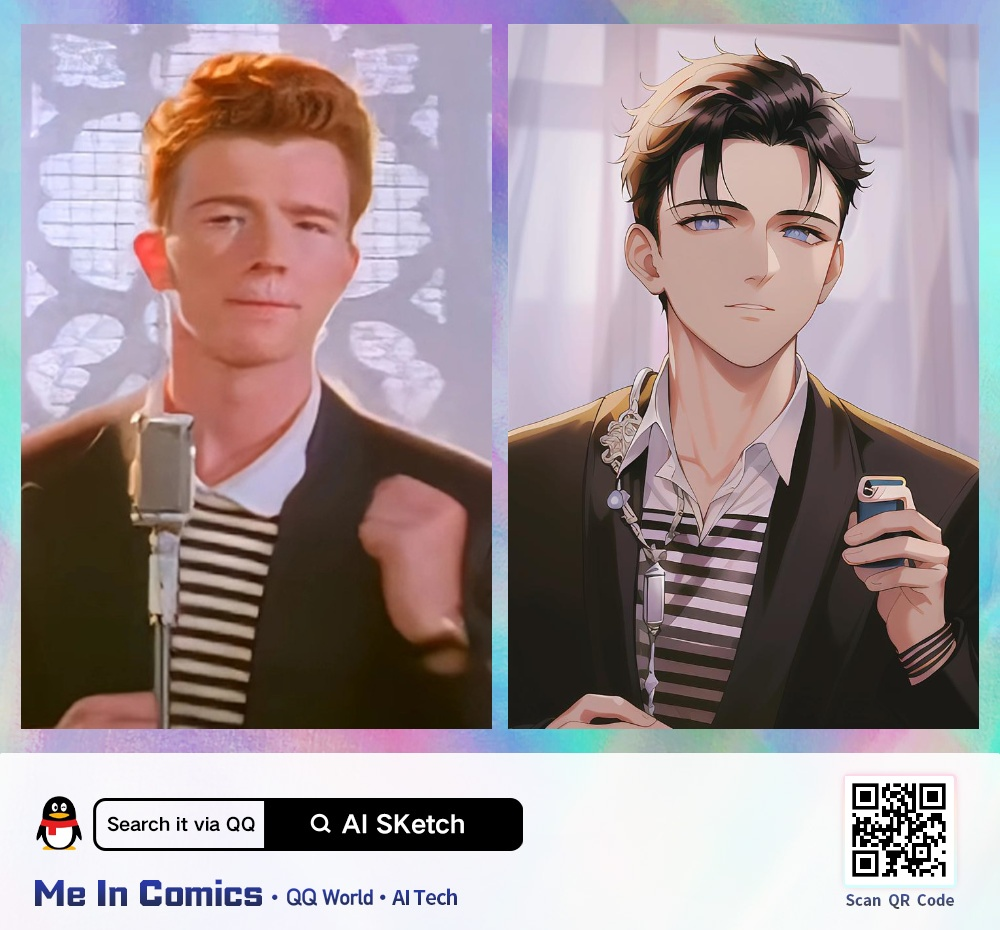
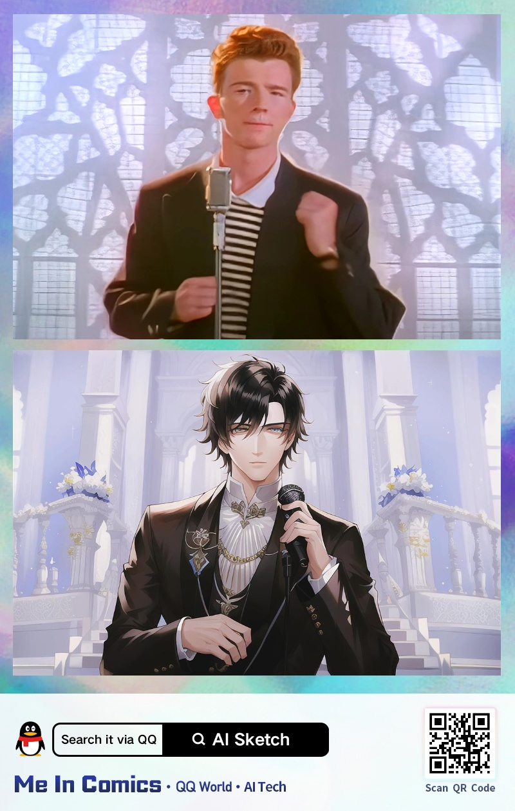

# QQ's API spec

The current API endpoint for usage outside China is: `https://ai.tu.qq.com/trpc.shadow_cv.ai_processor_cgi.AIProcessorCgi/Process`. Following are the details of the request:

## a. Request body

```json
{
  "busiId": "different_dimension_me_img_entry",
  "images": [
    "<base64>"
  ],
  "extra": "{\"face_rects\":[],\"version\":2,\"language\":\"en\",\"platform\":\"web\",\"data_report\":{\"parent_trace_id\":\"d5c3492b-037b-8dab-34bd-c1d7c85daef2\",\"root_channel\":\"\",\"level\":1}}"
}
```

### a.1. `images` field

The image content (bytes) must be encoded to a base64 string (hexdigest), and passed as a single-entry array in this field.
Sending multiple images in one request may be supported, but did'nt try it yet.

### a.1. `extra` field (JSON string)

- The whole `data_report` node seems to be optional.
- `data_report.parent_trace_id` can be a randomly-generated UUIDv4.

## b. Request headers

```json
{
  "x-sign-value": "<md5sum>",
  "x-sign-version": "v1",
  "Origin": "https://h5.tu.qq.com",
  "Referer": "https://h5.tu.qq.com/",
  "User-Agent": "<real user agent recommended>"
}
```

### b.1. x-sign

Since 2022-12-06, it is required to include the `x-sign-value` and `x-sign-version`; otherwise the API will return `AUTH_FAILED`.

The `x-sign-value` is the MD5 checksum hash from the following string: `'https://h5.tu.qq.com{A}HQ31X02e'`, where `{A}` is the length of the JSON body being sent.
Check the code for more details (`BaseAnimeConverter._get_sign_headers()` method).

## c. Response body

```json
{
  "code": 0,
  "msg": "",
  "images": [],
  "faces": [],
  "extra": "{\"img_urls\": [\"<image url>\"], \"uuid\": \"<uuid>\"}",
  "videos": []
}
```

### c.1. `extra` field (JSON string)

This field is a JSON string that contains the resulting images. Currently returns only one JPG picture, but repeated 4 times in the array.

The result format depends on whether the input image was vertical or horizontal/square.





## c.2. Errors

Response always returns 200. When conversion fails, response only includes `code` and `msg`, where `code != 0`.

Example response body of a failed request:

```json
{
  "code": 2114,
  "msg": "IMG_ILLEGAL"
}
```

### c.2.i. Identified errors

| `code`  | `msg`                                                                   | Description                                                                                              |
|---------|-------------------------------------------------------------------------|----------------------------------------------------------------------------------------------------------|
| `2114`  | `IMG_ILLEGAL`                                                           | Not allowed picture (nude, violence, political...)                                                       |
| `2111`  | `VOLUMN_LIMIT`                                                          | Possibly rate limit or image too big (retrying may return successfuly after some retries)                |
| `-2100` | `PARAM_INVALID`                                                         | Possibly invalid file or image format (gif, webp and other uncommon formats seem to be unsupported)      |
| `-2111` | `AUTH_FAILED`                                                           | Possibly invalid request body, missing parts on the request body or headers                              |
| `2119`  | `user_ip_country <origin country name in chinese>`, `service upgrading` | The API seems to be only available in China, so using a chinese proxy may be required                    |
| `1001`  | `b'no face in img'`                                                     | The picture has no human faces in it, so the API does not allow its conversion                           |
| `1`     | Internal error returned from backend                                    | Internal server error not handled (may be because their API fails or we send something unexpected by it) |
